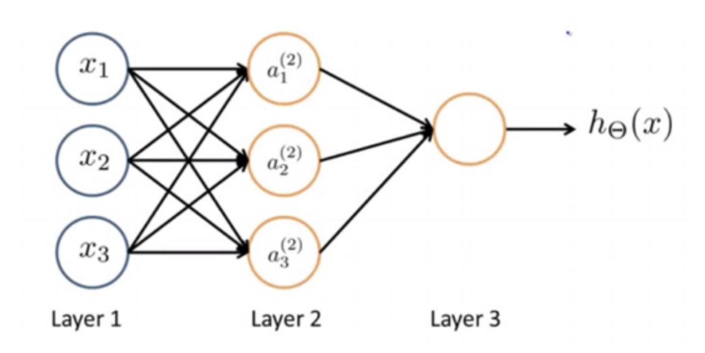

# Neural Network

## 简述

神经网络是由具有适应性的简单单元组成的广泛并行互连网络，它的组织能够模拟生物神经网络对真实世界物体所作出的交互反应。神经网络最基本的成分是神经元（neuron）模型，抽象后有了沿用至今的“M-P 神经元模型”。这个模型中，神经元接受来自 $n$ 个其它神经元传递过来的输入信号，这些信号通过带权重的连接进行传递，神经元接收到的总输入值将与神经元的阈值进行比较，然后通过“激活函数”处理以产生神经元的输出。

## 基本过程

这篇笔记仅仅简单得讲解一下浅层神经网络，关于神经网络的更为深层次的内容会在以后 Deep Learnig 的笔记中介绍。

首先，我们需要构建一个神经网络的模型。

如上图所示，一个基本的神经网络包含：输入层（Input Layer）、隐藏层（Hidden Layers）、输出层（Output Layer）。在输入层 Layer 1 中有最基本的输入元素 $x_1 , x_2 , x_3$ ，在隐藏层 Layer 2 中有经过“激活函数”计算后的值 $a_{j}^{i}$ (表示第 $i$ 层第 $j$ 个激活值) ，最后的输出层则输出结果 $y$ 。

用矩阵表示就是：
$$
\left[ 
\begin{matrix}
x_1\\x_2\\\vdots\\x_{s_1}  
\end{matrix}  
\right]
\rightarrow
\left[ 
\begin{matrix}
a_{1}^{(2)}\\a_{2}^{(2)}\\\vdots\\a_{s_2}^{(2)}
\end{matrix}  
\right]
\rightarrow
h_{\theta}(\pmb{x})
$$
接着我们看看 “激活函数”：
$$
\begin{equation}
\begin{aligned}
a_{j}^{(i)}&= g(\theta_{j,0}^{(i)}a_{0}^{(i-1)} + \theta_{j,1}^{(i)}a_{1}^{(i-1)} \dots  \theta_{j,s_{i-1}}^{(i)}a_{s_{i-1}}^{(i-1)})\\
&= g(z_{j}^{(i)})\\
\\
z_{j}^{(i)}& = \theta_{j,0}^{(i)}a_{0}^{(i-1)} + \theta_{j,1}^{(i)}a_{1}^{(i-1)} \dots  \theta_{j,s_{i-1}}^{(i)}a_{s_{i-1}}^{(i-1)}\\
\\
\pmb{a}^{(i)}&= g(\pmb{\Theta}^{(i-1)}{\pmb{a}}^{(i-1)}) \quad, \pmb{\Theta}^{(i-1)} \in \mathbb{R}^{s_{i} \times s_{i-1}} , \pmb{a^{(i-1)}} \in \mathbb{R}^{s_{i-1} \times 1}\\

\end{aligned} 
\end{equation}
$$
其中，函数 $g(z_{j}^{(i)})$ 是激活函数，$s_{i}$ 表示第 $i$ 层的维数。

为了得到正确的参数 $ \pmb{\Theta}^{(i)}$ ，我们需要不断更新它，如何更新呢？

首先，我们在初始的参数基础上，得到输出层的结果，根据这个结果与训练集的标记去比较，接着根据比较的结果（cost）去更新前面的参数。

我们使用一种名为 “back propagation”的方法去更新。

## 计算 cost 

首先我们先给出需要的变量：

- $L$ ：神经网络总层数；

- $s_l$ : 第 $l$ 层的维数，或者神经元的个数；

- $K$ ：输出层的维数，或者神经元个数；

于是，当输出为二分类时选 logistic regression 后，cost function为：
$$
J(\pmb{\Theta}) = -\frac{1}{m}\sum^{m}_{i=1} \sum^{K}_{k=1} [ y_{k}^{(i)}\log{(h_{\Theta}(x^{(i)})_k)}+ (1-y_k^{(i)})\log{(1-h_{\Theta}(x^{(i)})_k)} + \frac{\lambda}{2m} \sum_{l=1}^{L-1} \sum_{i=1}^{s_l} \sum^{s_{l+1}}_{j=1}(\pmb{\Theta}^{(l)_{j,i}})^2
$$

## 更新 $ \pmb{\Theta}^{(i)}$

back propagation 的基本思路是依据函数求导的链式效应。